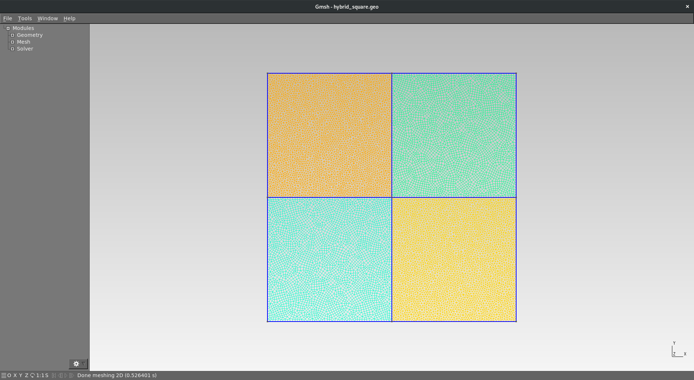
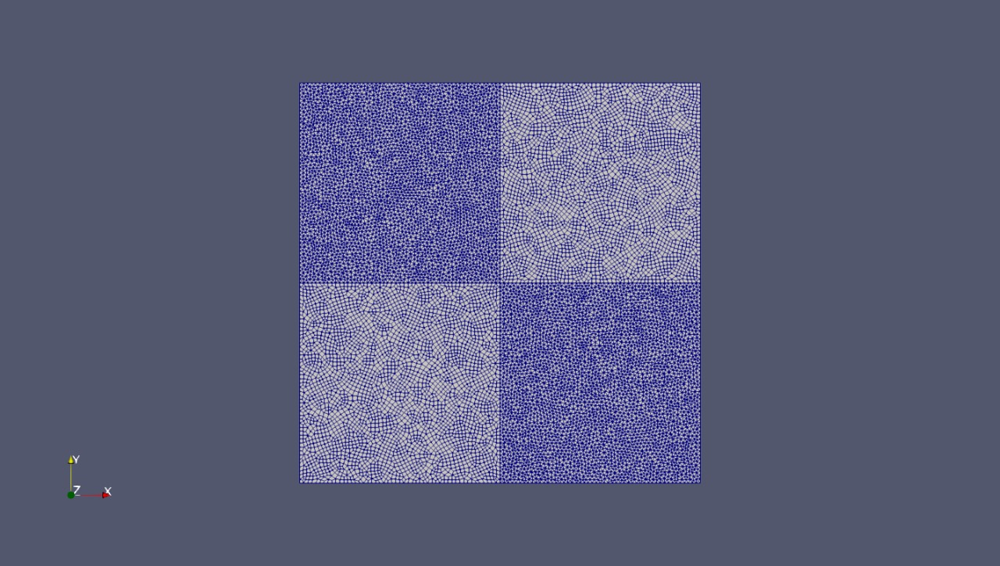
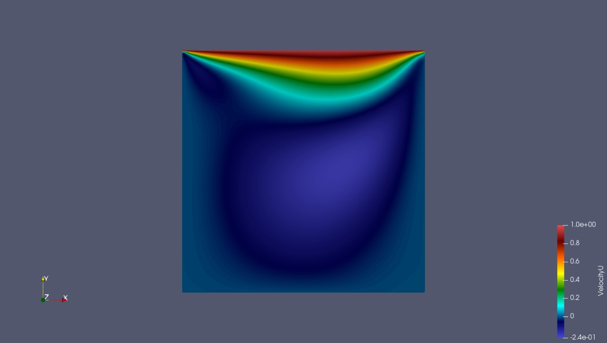
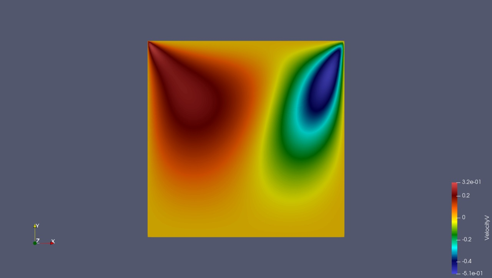

# MSHtoCGNS









Master: [](https://travis-ci.org/felipegiacomelli/MSHtoCGNS)
Develop: [](https://travis-ci.org/felipegiacomelli/MSHtoCGNS)

Reads a MSH file (from gmsh) and converts it to the CGNS format. This project currently supports:

## 2D grids
- hybrid grids (triangles and quadrangles)
- multiple physical surfaces

## 3D grids
- tetrahedra **or** hexahedra grids
- only one physical volume

---

## Dependencies

To build, it is necessary:

- g++/gcc 6.4 (at least)
- cmake
- make
- CGNS 3.3.1
- Boost 1.66

Once you have installed the first three dependecies, you may install **boost** and **CGNS** by executing **setup.sh** located in *Zeta/Setup/*. This script will install **shared libraries** in **debug** variant.

## Building

Simply execute:

```shell
$ mkdir build
$ cd build
$ cmake .. -G "Unix Makefiles" -DCMAKE_BUILD_TYPE=Debug -DBUILD_SHARED_LIBS=TRUE
$ make
```

If you would like to run the tests:
```shell
$ make test
```

## Converting

The file **Script\*.json** located in *Zeta/* specify the path to the .msh file (**input**) and the path where the directory containing the .cgns file will be created (**output**). Thus, once you have the paths set up, you may execute:

```shell
$ ./MSHtoCGNS -(dimension)
```

Where dimension specifies the msh grid's dimension.