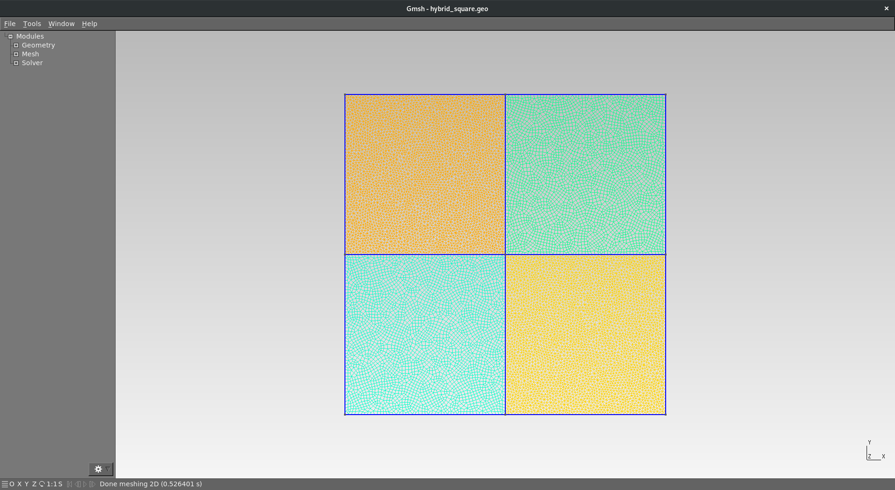
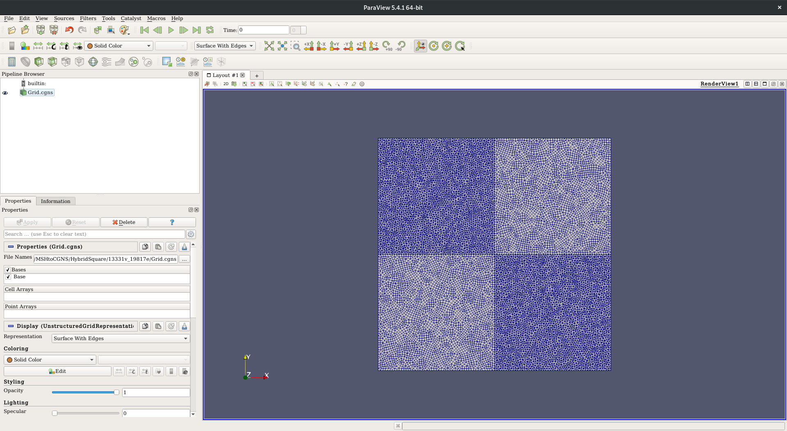
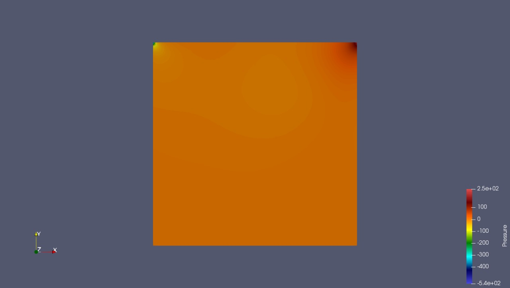
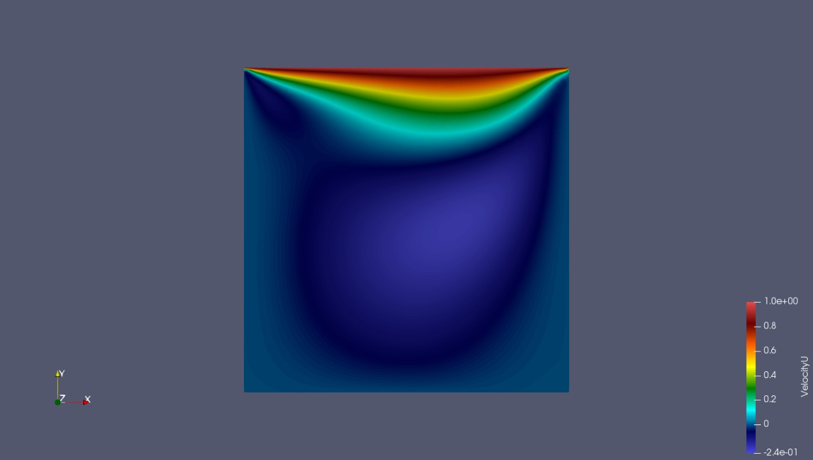
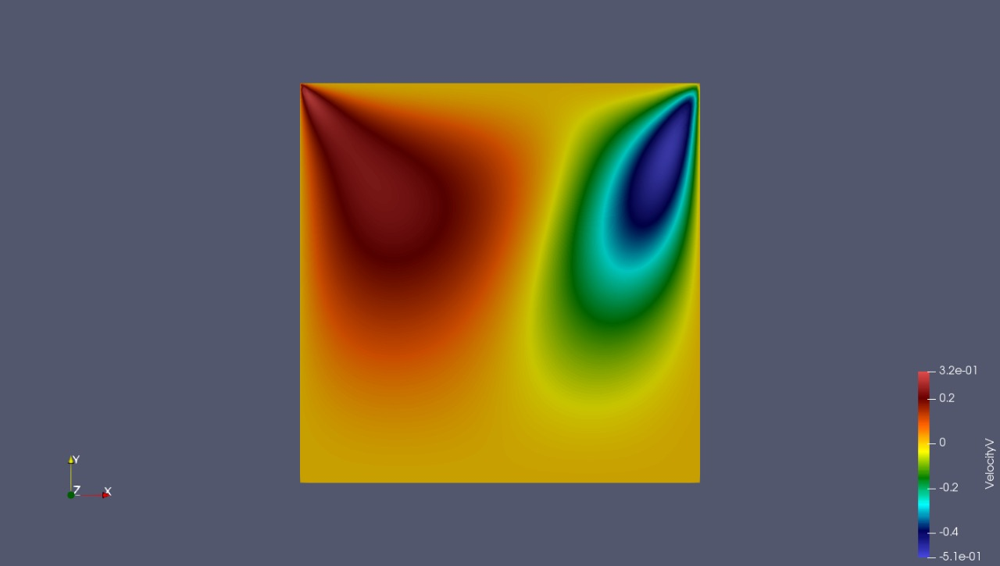
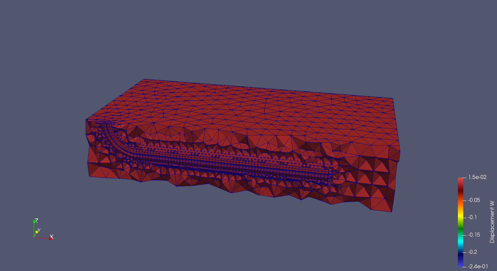
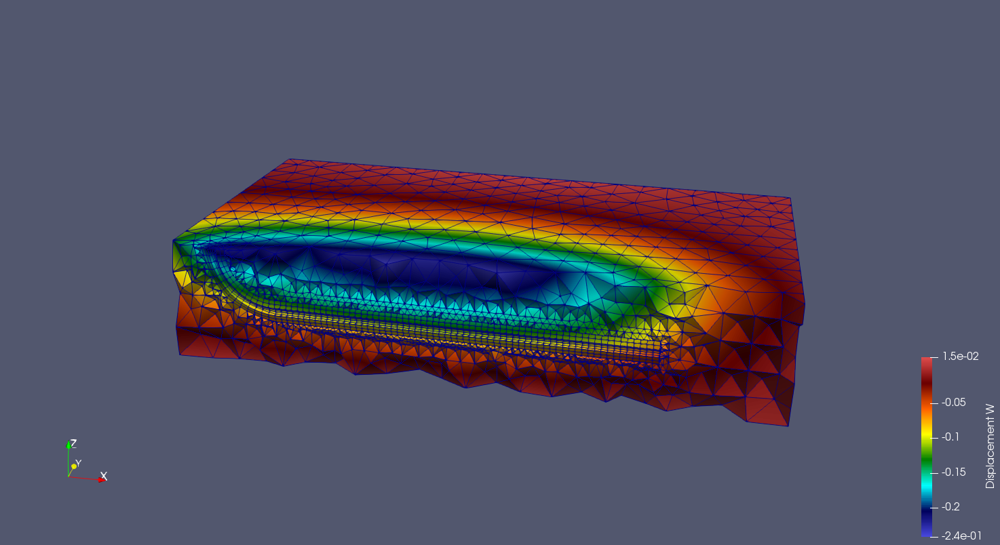
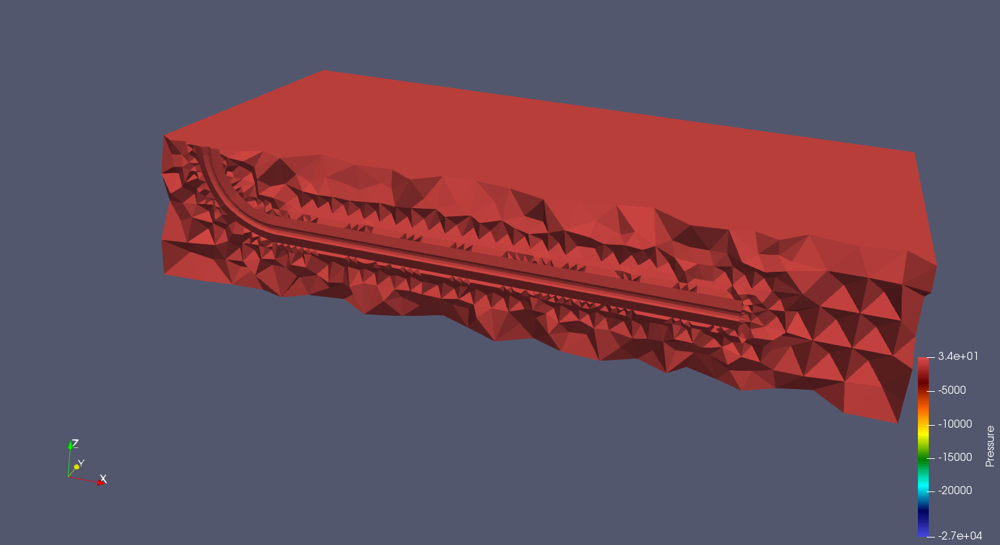
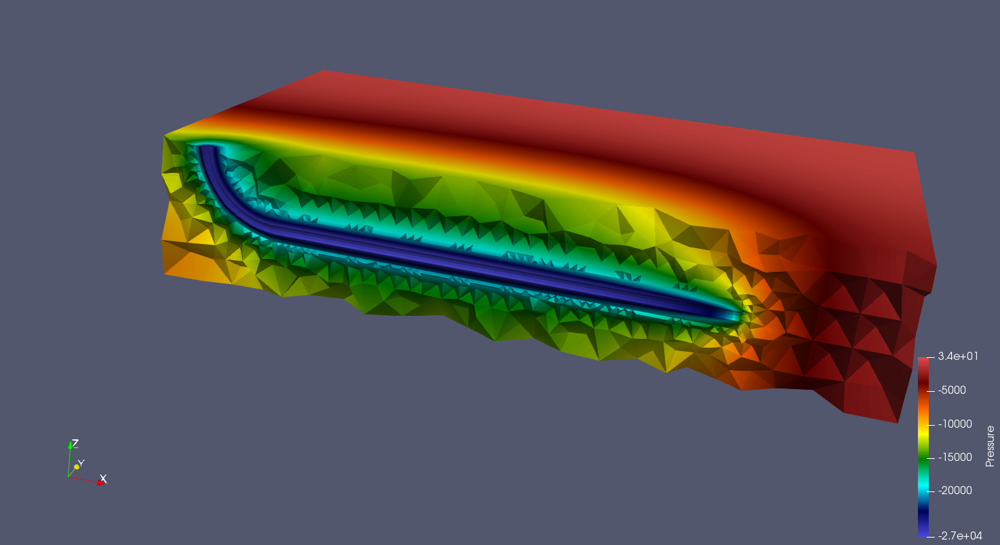

# MSHtoCGNS

Master: [](https://travis-ci.org/felipegiacomelli/MSHtoCGNS)
Develop: [](https://travis-ci.org/felipegiacomelli/MSHtoCGNS)

Generate a gmsh format grid using [gmsh](http://gmsh.info/):



Convert it to the CGNS format and open it with [paraview](https://www.paraview.org/):



This project currently supports:

## 2D grids
- hybrid grids (triangles and quadrangles)
- multiple physical surfaces

## 3D grids
- tetrahedra **or** hexahedra grids
- only one physical volume

## CGNS IO
- read 2D single element or mixed element unstructured grids
- read 3D single element or hybrid unstructured grids
- read well in 3D unstructured grids
- write simulation results


---

## Dependencies

To build, it is necessary:

- g++/gcc 6.4 (at least)
- cmake
- make
- CGNS 3.3.1
- Boost 1.66 (at least)

Once you have installed the first three dependecies, you may install **boost** and **CGNS** by executing **setup.sh** located in *Zeta/Setup/*. This script will install **shared libraries** in **release** variant.

## Building

Simply execute:

```shell
$ mkdir build
$ cd build
$ cmake .. -G "Unix Makefiles" -DCMAKE_BUILD_TYPE=Debug -DBUILD_SHARED_LIBS=TRUE
$ make
```

If you would like to run the tests:
```shell
$ make test
```

## Converting

The file **Script\*.json** located in *Zeta/* specify the path to the .msh file (**input**) and the path where the directory containing the .cgns file will be created (**output**). Thus, once you have the paths set up, you may execute:

```shell
$ ./MSHtoCGNS -(dimension)
```

Where dimension specifies the msh grid's dimension.

## Simulate

Simulation results may be easily visualised.

<p float="left">
    
    
    
</p>

<p float="left">
    
    
</p>

<p float="left">
    
    
</p>
